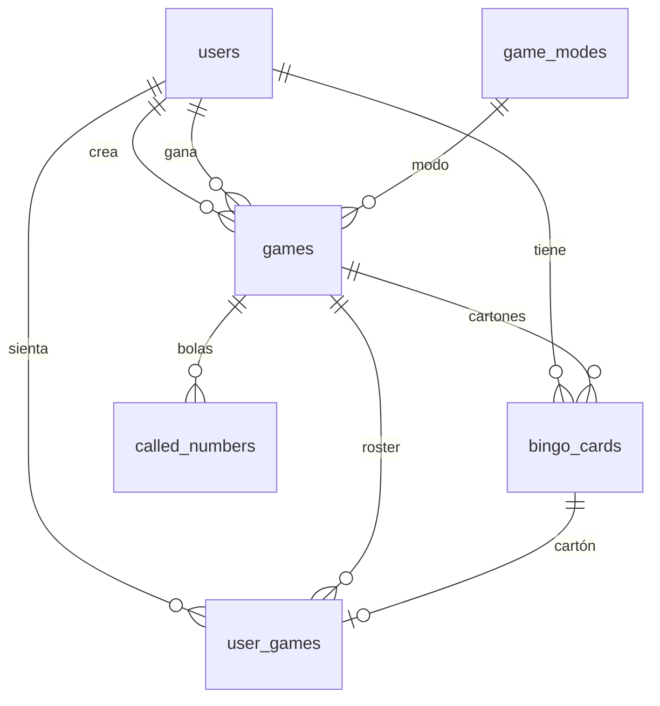

# Bingonline (BINGO-2)

Bingo en tiempo real para jugar en mesa: crear o unirse a una sala, marcar el cartón y cantar bingo. **No hay dinero real.**

| Carpeta | Qué es |
| --- | --- |
| `bingo-frontend` | Cliente (Preact + Vite + Tailwind + Socket.IO + Zustand) |
| `bingo-backend` | API REST + WebSockets (Express + Sequelize + MySQL) |

| Entorno | URL |
| --- | --- |
| Web | [https://www.bingonline.fun](https://www.bingonline.fun) · [Vercel](https://bingo-2-ten.vercel.app) |
| API | [https://bingo-backend-shwj.onrender.com](https://bingo-backend-shwj.onrender.com) |
| Swagger | [https://bingo-backend-shwj.onrender.com/api/docs](https://bingo-backend-shwj.onrender.com/api/docs) |

Local: API `http://localhost:3000` · Swagger `http://localhost:3000/api/docs` · front `http://localhost:5173`.

---

## Cómo se juega

```
Inicio (/)
  → invitado / cuenta / Google
    → Lobby (/games)  — mis mesas y crear
    → Buscar mesas (/game)  — públicas o por código
      → Espera (/game/:id)
        → el anfitrión inicia
          → Partida (/playing/:id)
            → alguien canta bingo  ──┐
            → se acaba el tiempo     ├── pantalla de ganador
                                     └── el anfitrión pasa de ronda
```

1. En `/` escribes un nombre y entras como invitado, o usas **Iniciar sesión** / **Crear cuenta** (correo o Google).
2. En el **lobby** (`/games`) ves tus mesas y puedes crear una.
3. En **buscar** (`/game`) entras por **nombre o código de sala** (no por ID). Si la mesa es privada, pide la clave.
4. En **espera** el anfitrión configura (modo, tiempo, visibilidad, clave) y pulsa iniciar.
5. En **partida** las bolas salen solas cada 5 s. Marcas tu cartón y pulsas **¡BINGO!** cuando tengas la figura.
6. Si nadie gana antes de que se acabe el tiempo, sale la **ruleta de consolación**.

---

## Cuentas

| Tipo | Cómo | Notas |
| --- | --- | --- |
| Invitado | Nombre en la home | Sin correo. Nickname único. JWT 12 h. |
| Local | Correo + contraseña | Registro. JWT 1 h. |
| Google | “Continuar con Google” | Mismo `GOOGLE_CLIENT_ID` en front y back. JWT 1 h. |

El cliente guarda el JWT en `localStorage` (`authStore`). Rutas `/games`, `/game`, `/game/:id` y `/playing/:id` piden estar autenticado (invitado cuenta).

Google Cloud: pantalla de consentimiento OAuth → ID de cliente web. Orígenes autorizados **sin barra final**: `http://localhost:5173`, `http://127.0.0.1:5173`, `https://bingo-2-ten.vercel.app`, `https://www.bingonline.fun`. En incógnito Google a veces responde 403 “origin not allowed”.

---

## Mesas

Al crear una mesa eliges:

- Nombre y código de 6 caracteres (se genera solo)
- Pública o privada (ambas salen en el listado)
- Clave de unión (`join_key`, 4–20 caracteres) si es **privada**
- Tiempo de ronda: **3 a 6 minutos**
- Figura ganadora (modos 1–9)

**Estados:** `active` (espera) → `in_progress` (ronda) → `completed` (ganador, ruleta o cierre).

- Si la ronda **ya empezó**, quien entra queda en **cola** (`is_spectator`). Juega desde la siguiente ronda.
- El anfitrión edita la mesa solo en espera. La clave no se envía al resto de clientes.
- Si nadie queda conectado ~60 s, la mesa se cierra.
- Quien se desconecta en espera pierde la silla a los 20 s. En partida sigue en la mesa pero no aparece como online hasta que vuelva.

---

## Partida (`/playing/:id`)

### Cartón

- 5×5, columnas B-I-N-G-O. El centro es **FREE**.
- Solo puedes marcar un número **después** de que salga.
- Las marcas se guardan en el servidor (`marked_numbers`).
- El bingo **no se canta solo**. El servidor comprueba la figura contra las bolas cantadas, no contra lo que el cliente dice.

### Bingo o nada (último minuto)

Cuando quedan **60 segundos o menos**:

- El cronómetro pasa a “Bingo o nada”.
- Si pulsas **¡BINGO!** **sin** tener la figura, quedas **eliminado** (`eliminated_at`).
- No puedes marcar ni cantar más. No entras en la ruleta.
- Antes del último minuto, un bingo falso solo muestra error.

### Ruleta de consolación

Si nadie gana al llegar a `00:00`:

1. El servidor (`services/roundTimer.js`) para las bolas y sortea.
2. Cada jugador recibe **1 papeleta + 1 por cada ficha marcada** sobre un número cantado.
3. Los eliminados tienen **0 papeletas**.
4. Todos ven la ruleta (`roundRaffle`) y luego la pantalla de ganador.

El reloj lo decide el **servidor** (`started_at` + `game_time`), no el cliente.

### Rondas

- **Nueva ronda:** se limpian bolas, marcas y eliminaciones; el cronómetro vuelve a empezar.
- **Otra figura (continuar):** mismas bolas, otra figura; también reinicia el reloj.
- Quienes estaban en cola entran a jugar al pasar de ronda.

---

## Figuras (modos 1–9)

| Id | Modo |
| --- | --- |
| 1 | Cartón completo |
| 2 | Diagonal derecha |
| 3 | Diagonal izquierda |
| 4–8 | Columna B / I / N / G / O |
| 9 | Patrón personalizado 5×5 |

Misma lógica en cliente (`src/utils/bingoWin.js`) y servidor (`utils/bingoCard/winPattern.js`).

---

## Cómo funciona el backend

El proceso HTTP y Socket.IO **es el mismo servidor**. Arranca aunque MySQL falle (para no romper `/socket.io`) y reintenta la base en segundo plano.

Al conectar MySQL:

1. Limpia duplicados suaves.
2. `sequelize.sync()` (con `DB_SYNC_ALTER=true` hace `alter`).
3. Añade columnas que falten: `is_public`, `win_pattern`, `room_code`, `join_key`, `is_spectator`, `eliminated_at`.
4. Siembra modos 1–9.
5. Reanuda cantadores y cronómetros de mesas `in_progress`.
6. Cierra mesas vacías y barre presencia.

| Servicio | Qué hace |
| --- | --- |
| `ballCaller.js` | Primera bola ~2 s tras iniciar; luego cada **5 s**. Emite `numberCalled`. |
| `roundTimer.js` | Programa el fin de ronda; último minuto = “Bingo o nada”; al acabar, ruleta. |
| `presence.js` | Online / ausente / desconectado en memoria (no en MySQL). |
| `playerRoster.js` | Salir, promover cola, cerrar mesa vacía. |
| `authServices.js` | JWT, bcrypt, Google, invitados. |

Auth REST: JWT opcional (`optionalAuth`). Si no hay token, muchos endpoints aceptan `user_id` o `creator_id` en el body.

---

## Base de datos

MySQL (local o Aiven). Esquema canónico: `bingo-backend/database/schema.sql`.



| Tabla | Para qué |
| --- | --- |
| `users` | Cuentas. `provider`: `local` \| `google` \| `guest`. Email único; invitados usan un email interno `@bingo.local`. |
| `game_modes` | Figuras 1–9 (seed al arrancar). |
| `games` | Mesa: nombre, `room_code` (único, 6 chars), estado, tiempo 3–6, `is_public`, `join_key`, patrón JSON, ganador, `started_at` / `ended_at`. |
| `user_games` | Un usuario **una vez** por mesa. `is_spectator` = cola. `eliminated_at` = bingo falso en el último minuto. |
| `bingo_cards` | Un cartón por usuario y mesa. `numbers` JSON 5×5, `marked_numbers` JSON. |
| `called_numbers` | Bolas 1–75, **únicas** por mesa (`game_id` + `number_called`). |

Aiven: SSL (`DB_SSL=true`). Filtro de IP en **Service settings → Cloud and network**. `0.0.0.0/0` vale para Render.

`DB_SYNC_ALTER=true` solo cuando cambies modelos a propósito.

---

## API REST

Prefijo **`/api`**. Documentación interactiva:

- UI: [`/api/docs`](http://localhost:3000/api/docs)
- Spec: [`/api/openapi.json`](http://localhost:3000/api/openapi.json)

En Swagger: **Authorize** → `Bearer <token>` de `/login`, `/register`, `/auth/guest` o `/auth/google`.

### Auth

| Método | Ruta | Qué hace |
| --- | --- | --- |
| POST | `/login` | Correo + contraseña → `{ token }` |
| POST | `/register` | Cuenta local → `{ token }` |
| POST | `/auth/guest` | Nickname → `{ token, isGuest }` |
| POST | `/auth/google` | `{ credential }` de GIS → `{ token }` |

### Mesas

| Método | Ruta | Qué hace |
| --- | --- | --- |
| GET | `/game` | Mesas `active` / `in_progress` (públicas y privadas) + `online_count` |
| GET | `/game/search?q=` | Busca por **nombre o código**, no por ID |
| GET | `/game/:id` | Detalle (id, código o nombre). El anfitrión ve `join_key` |
| POST | `/game` | Crear (sienta al anfitrión, emite `gameCreated`) |
| PUT | `/games/:id` | Configurar (solo host, solo espera) |
| POST | `/games/:id/start` | Inicia ronda, bolas y reloj |
| POST | `/games/:id/restart` | Nueva ronda o otra figura (`keep_called_numbers`) |
| POST | `/games/:id/claim-win` | Cantar bingo (validación en servidor) |
| PATCH | `/games/:id/finalize` | Cerrar mesa |
| PATCH | `/games/:id/activate` | Volver a espera, limpia bolas |

### Jugadores

| Método | Ruta | Qué hace |
| --- | --- | --- |
| GET | `/game/:id/players` | Roster + `presence` |
| POST | `/game/:id/join` | Unirse. Privada: `join_key`. Ronda en curso → cola |
| POST | `/game/:id/leave` | Salir |

### Cartones y bolas

| Método | Ruta | Qué hace |
| --- | --- | --- |
| POST | `/generate-card` | Un cartón por usuario/mesa. Cola no genera |
| GET | `/cards/:user_id/:game_id` | Tu cartón |
| GET | `/game/:id/cards` | Cartones ajenos: **solo espectadores** |
| PUT | `/bingo-cards/:id` | Regenerar (solo espera) |
| PATCH | `/bingo-cards/:user_id/:game_id/marks` | Guardar fichas |
| GET \| POST | `/called-number/:game_id` | Historial / forzar siguiente bola |

`claim-win` valida la figura en el servidor. Si falla en el último minuto, elimina al jugador.

---

## Tiempo real (Socket.IO)

Misma URL que la API. El cliente usa `bingo-frontend/src/utils/socket.js`:

- Contra **HTTPS** (Render): solo `websocket` (Render no tiene sticky sessions; el polling acaba en 404 y el navegador lo muestra como CORS).
- Contra **HTTP local**: `polling` + `websocket`.

CORS del servidor incluye `localhost:5173`, Vercel, `bingonline.fun` y `FRONTEND_URL`.

### Cliente → servidor

| Evento | Payload | Efecto |
| --- | --- | --- |
| `joinGameChat` | `gameId` | Entra a la sala `game:{id}` y recibe historial (últimos 100, en memoria) |
| `presenceJoin` | `{ gameId, userId, … }` | Marca online |
| `presenceAway` / `presenceBack` | — | Ausente / de vuelta |
| `chatMessage` | `{ message, nickname, userId, gameId, isHost }` | Chat de mesa (máx. 500 chars) |

### Servidor → cliente

| Evento | Cuándo |
| --- | --- |
| `numberCalled` | Sale una bola |
| `gameCreated` / `gameUpdated` | Mesa nueva o editada |
| `gameStarted` / `gameRestarted` / `gameWon` / `gameClosed` | Ciclo de la mesa |
| `roundRaffle` | Se acabó el tiempo → ruleta |
| `playerEliminated` | Bingo falso en el último minuto |
| `playerJoined` / `playerLeft` | Entra o sale |
| `spectatorsPromoted` | La cola pasa a jugar |
| `playerPresence` | Online / ausente / se fue |
| `chatMessage` / `chatHistory` | Chat |

---

## Rutas del cliente

| Ruta | Pantalla |
| --- | --- |
| `/` | Inicio: invitado, login y registro |
| `/login` | Login / registro |
| `/terms` · `/privacy` | Legal |
| `/games` | Lobby |
| `/game` | Buscar mesas |
| `/game/:id` | Sala de espera |
| `/playing/:id` | Partida |

---

## Cómo correrlo

Hace falta **Node.js** y **MySQL**.

### Backend

```bash
cd bingo-backend
# .env con DB_* y JWT_SECRET
npm install
npm run dev
```

Queda en `http://localhost:3000`. Swagger: `http://localhost:3000/api/docs`.

### Frontend

```bash
cd bingo-frontend
# .env con VITE_API_URL=http://localhost:3000
npm install
npm run dev
```

Vite en el puerto **5173**.

Para probar el front local contra Render: `VITE_API_URL=https://bingo-backend-shwj.onrender.com` (el cliente usará solo WebSocket).

---

## Variables de entorno

No subas archivos `.env`.

**Backend**

| Variable | Uso |
| --- | --- |
| `DB_NAME` `DB_USER` `DB_PASSWORD` `DB_HOST` `DB_PORT` | MySQL |
| `DB_SSL` / `DB_SSL_MODE` | `true` o `REQUIRED` en Aiven |
| `JWT_SECRET` | Firma de tokens |
| `GOOGLE_CLIENT_ID` | Mismo ID que el front |
| `FRONTEND_URL` | Origen extra de CORS (p. ej. Vercel) |
| `PORT` | **No** lo pongas en Render; lo asigna la plataforma |
| `DB_SYNC_ALTER` | `true` solo para alterar tablas |

**Frontend**

| Variable | Uso |
| --- | --- |
| `VITE_API_URL` | URL del backend **sin** `/api` |
| `VITE_GOOGLE_CLIENT_ID` | Mismo ID que el backend |

Tras cambiar un `.env`, reinicia ese servidor.

---

## Despliegue

- **Frontend → Vercel.** Root `bingo-frontend`. Env: `VITE_API_URL`, `VITE_GOOGLE_CLIENT_ID`.
- **Backend → Render.** Root `bingo-backend`, build `npm install`, start `npm start`, Node, rama `main`. Env: `DB_*`, `JWT_SECRET`, `GOOGLE_CLIENT_ID`, `FRONTEND_URL=https://bingo-2-ten.vercel.app`. No definas `PORT`.
- El plan free de Render **se duerme**; el primer request tarda. WebSockets deben estar activos (lo están por defecto).

---

## Estructura

```
bingo-backend/
  controller/       REST: auth, mesas, jugadores, cartones, bolas
  services/         ballCaller, roundTimer, presence, playerRoster, auth
  utils/bingoCard/  generador + winPattern
  utils/gamePublic.js  públicas/privadas y join_key
  model/            Sequelize
  database/         schema.sql, seed, migraciones
  docs/openapi.js   spec Swagger
  socket.js         instancia de Socket.IO
bingo-frontend/
  src/routes/       home, lobby, buscar, espera, partida
  src/components/game/
  src/utils/socket.js  cliente Socket.IO (websocket en HTTPS)
  store/            auth, game, bolas, jugadores, chat, presencia
```

---

## Notas

- Contacto legal: `josebenjumea2005@gmail.com`.
- Los `.env`, `node_modules` y `dist` no van al remoto.
- Tras clonar: crear los `.env`, `npm install` en backend y frontend, y levantar MySQL.
- Reinicia el **backend** si cambias timers, validación de bingo o columnas nuevas.
